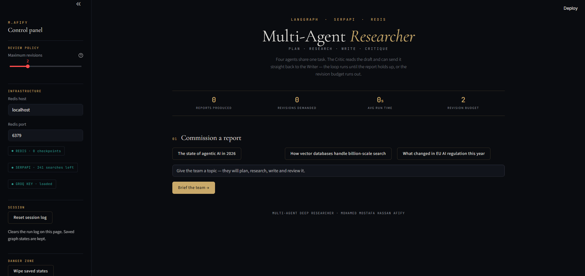
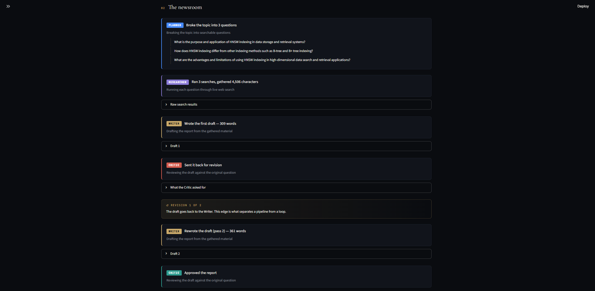
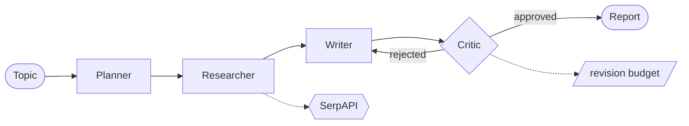

# Multi-Agent Deep Researcher

**Four agents share one task — and one of them is allowed to reject the others' work.**


---

## The idea

A single model asked to "write a report" gives you its first attempt and calls it finished.
This system splits the job across four agents and puts a reviewer at the end who can send
the work back.

| Agent | Role |
| :--- | :--- |
| **Planner** | Breaks the topic into three searchable questions |
| **Researcher** | Runs each question through live web search |
| **Writer** | Drafts the report from the gathered material only |
| **Critic** | Judges the draft against a rubric — approve, or send it back |

The `critic → writer` edge is the whole point. It is what turns a pipeline into a loop.



---

## Watching the loop run

Every agent reports as it works: the questions the Planner chose, how much material the
Researcher gathered, the length of each draft, and what the Critic asked for.



In this run the Critic rejected a 309-word first draft, and the second pass came back at
361 words with the structure and citations it had asked for. Without the loop you would be
reading draft one.

---

## How it works



State moves through a `TypedDict` carrying the plan, the research, the current draft, the
Critic's feedback and a revision counter. Every step is checkpointed to Redis, so a run is
resumable and inspectable rather than a black box.

The revision budget is the safety valve: without it, a reviewer that never approves would
loop forever.

---

## Engineering notes

Four agents are easy to wire together. Making them produce something trustworthy took
longer, and every fix below came from reading output that looked fine until you checked it.

### The revision loop never actually ran

The Critic's verdict was parsed like this:

```python
if "Approved" in feedback:      # looks reasonable
```

`"Not Approved. The report lacks sources."` contains `"Approved"`. So did
`"I cannot mark this as approved until sources are cited."` Every rejection that used the
word was silently read as an approval, and the loop the whole project is built around
could not fire.

Anchoring on the first word instead fixed 4 of 9 test verdicts that the substring check got
wrong.

### The Writer was inventing its sources

`SerpAPIWrapper.run()` returns a single condensed snippet per query — around 300
characters. Three searches gave the Writer under 1,000 characters to build a report from,
so it filled the gap from its own weights and produced reference lists like:

```
[1] "Vector Databases: A Survey" by [Author], [Year]
Note: The references listed above are fictional.
```

Pulling the structured results instead (`search.results()`) hands the Writer real titles,
snippets and URLs — about **4,500 characters** per run. Citations became real:
`redis.io`, `pinecone.io`, `developer.ibm.com`.

### A reviewer with no bar rejects everything

The Critic prompt opened with *"You are a strict quality reviewer."* A strict reviewer with
no defined standard always finds something, so the first draft was rejected on every single
run. That is not judgement, it is a fixed cost.

Replacing it with a five-item checklist and an explicit pass condition — *"a report does not
need to be exhaustive to pass; it needs to be accurate and answer the question"* — made
approval reachable.

### The reviewer's notes were ending up in the deliverable

The Writer prompt injected `Reviewer notes: {feedback}` for context, and the model helpfully
included them in the report. Finished reports were ending with:

```
Rating: 8/10
Recommendation: The writer should provide more detail...
```

The fix was one explicit line: these notes are instructions for you, they must not appear
anywhere in the report.

### Citation integrity is checked, not hoped for

An early report cited `(1)`, `(2)`, `(3)` in the body with no reference list anywhere. Now
the Writer is required to give every numbered marker a matching entry carrying a real URL,
and the Critic's checklist tests for it — markers without a reference list fail the review.

### Failures are visible instead of silent

A wrong API key does not raise; it just returns nothing, and the agents produce a confident
report built on nothing. The app now validates the search key on load and shows the
remaining quota, and any run where searches failed is labelled **not grounded in live
sources** above the report.

---

## Getting started

**Prerequisites** — Python 3.10+, Docker, a [Groq](https://console.groq.com) key and a
[SerpAPI](https://serpapi.com) key.

> SerpAPI and Serper.dev are different services with different keys. A Serper key in
> `SERPAPI_API_KEY` fails silently and every report becomes fiction.

```bash
git clone https://github.com/mohamedmhafify/Multi-Agent-Deep-Researcher.git
cd Multi-Agent-Deep-Researcher

python -m venv venv
source venv/bin/activate          # Windows: venv\Scripts\activate
pip install -r requirements.txt

docker compose up -d              # Redis Stack on :6379, RedisInsight on :8001

cd src
streamlit run app.py
```

`.env` in the project root:

```ini
GROQ_API_KEY=your_groq_key
SERPAPI_API_KEY=your_serpapi_key

# optional
REDIS_HOST=localhost
REDIS_PORT=6379
GROQ_MODEL=llama-3.1-8b-instant
MAX_REVISIONS=2          # how many times the Critic may send a draft back
RESULTS_PER_QUERY=5      # organic results pulled per search
```

> Redis must be **Redis Stack**, not the plain `redis:7` image — LangGraph's checkpointer
> builds its indexes with RediSearch (`FT.*`) commands. `docker exec -it redis-stack
> redis-cli FT._LIST` should return an empty list, not an error.

---

## Project structure

```
Multi-Agent-Deep-Researcher/
├── src/
│   ├── app.py                    Streamlit interface with the live trace
│   ├── agents.py                 the four agents and the routing rule
│   ├── graph.py                  LangGraph wiring + Redis checkpointer
│   ├── state.py                  shared state passed between agents
│   └── .streamlit/config.toml    dark theme
├── docker-compose.yml            Redis Stack
├── researcher_experiment.ipynb   exploration notebook
└── requirements.txt
```

---

## The interface

- **Live trace** — each agent as it finishes, colour-coded, with the revision loop marked
- **Full transparency** — the Planner's questions, raw search results, and every draft
- **Live controls** — revision budget applied without a restart
- **Infrastructure status** — Redis checkpoints, SerpAPI quota, key validity at a glance
- **Grounding warning** — a run whose searches failed is flagged before you read the report
- **Wipe saved states** — clear Redis so a repeated topic runs the agents again

---

## Stack

| Layer | Technology |
| :--- | :--- |
| Orchestration | LangGraph — `StateGraph`, conditional edges, revision loop |
| Reasoning | Groq — Llama 3.1 |
| Retrieval | SerpAPI — structured organic results |
| State | Redis Stack — checkpointed graph state per thread |
| Interface | Streamlit |

---

## Author

**Mohamed Mostafa Hassan Afify**

Data Analyst &amp; AI Engineer — [GitHub](https://github.com/mohamedmhafify) · [LinkedIn](https://linkedin.com/in/mohamedmhafify) · [Portfolio](https://mohamedmhafify.github.io)
